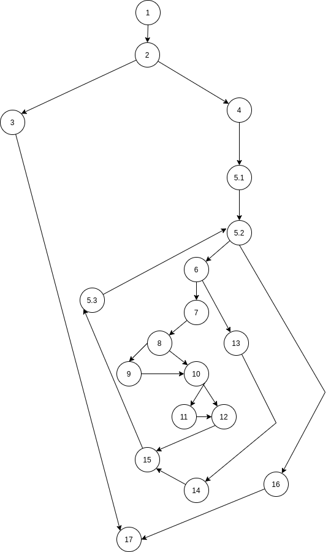

# SI_lab2_172003

# Група на код: 
Група 5

# Control Flow Graph:

# Цикломатска комплексност
3 методи подолу за наоѓање на цикломатска комплексност:
Од формулата  (e(edge) - n(node) + 2 = 6)
              Бројот на региони = 6
              Бројот на предикатни јазли + 1 = 6
   
